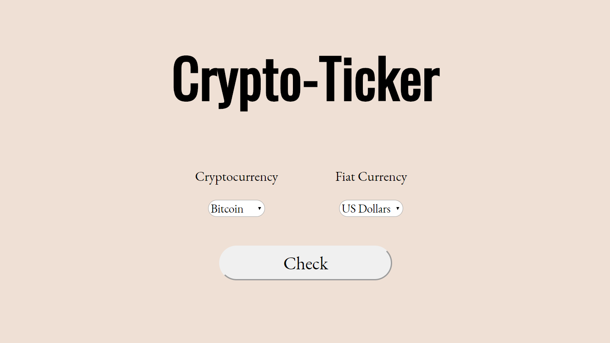

# Crypto-Ticker

Check the latest price of a particular cryptocurrency using the [BitcoinAverage API](https://apiv2.bitcoinaverage.com/)! Visit the [site](https://enigmatic-citadel-31100.herokuapp.com/) (thanks Heroku!)...

Or, if you'd like, see below for steps on how to host the app locally (Windows).



## Install Node.js (required)
Node.js is used to greatly simplify the development of JavaScript web apps.

Install the recommended version of Node.js [here](https://nodejs.org/en/). Follow the prompts on the screen and choose the default settings.

## Install Git Bash (recommended)
[Git Bash](https://www.atlassian.com/git/tutorials/git-bash) (Bourne Again SHell) is a text-only [command line interface (CLI)](https://www.w3schools.com/whatis/whatis_cli.asp). CLIs intake text inputs to execute operating system commands, such as navigating directories (folders) or installing software. If you prefer not to use Git Bash, you can use Windows PowerShell instead (NOT the command prompt!).

Install Git [here](https://git-scm.com/downloads), which includes Git Bash in the installation. Follow the prompts on the screen and choose the default settings.

## Getting Started
1. Open up **Git Bash** (or another CLI) and run the command
```shell
$ npm -v
```
to see if Node.js has been properly installed. A **version number** should be returned.

2. **Download and extract** the `crypto-ticker-master` folder to your desktop (or any other desired location).

3. **Navigate** to the `crypto-ticker-master` folder containing `index.js` and `index.html` with Git Bash using the `cd` command. To see what directory you're currently in, run `ls` to list all files in your current directory. Typically, your command should look something like this if you extracted `crypto-ticker-master` to your desktop:
```shell
$ cd desktop/crypto-ticker-master
```
> learn more about the command line [here](https://www.w3schools.com/whatis/whatis_cli.asp)

4. Initialize **npm** (Node Package Manager) by running the command
```shell
$ npm init
```
in the *same* directory. Then, press enter until package.json is compiled.

5. Install **nodemon** in the *same* directory by running the command:
```shell
$ npm install -g nodemon
```

6. Install **Express** and **body-parser** in the *same* directory by running the command:
```shell
$ npm install express body-parser
```

6. **Run** `index.js` with the command:
```shell
$ nodemon index.js
```

7. Go to the **Chrome** browser and type in `localhost:3000` in the address bar.

8. **AND WE'RE DONE!** You're all set up now. Press `ctrl+c` to stop the local server.
